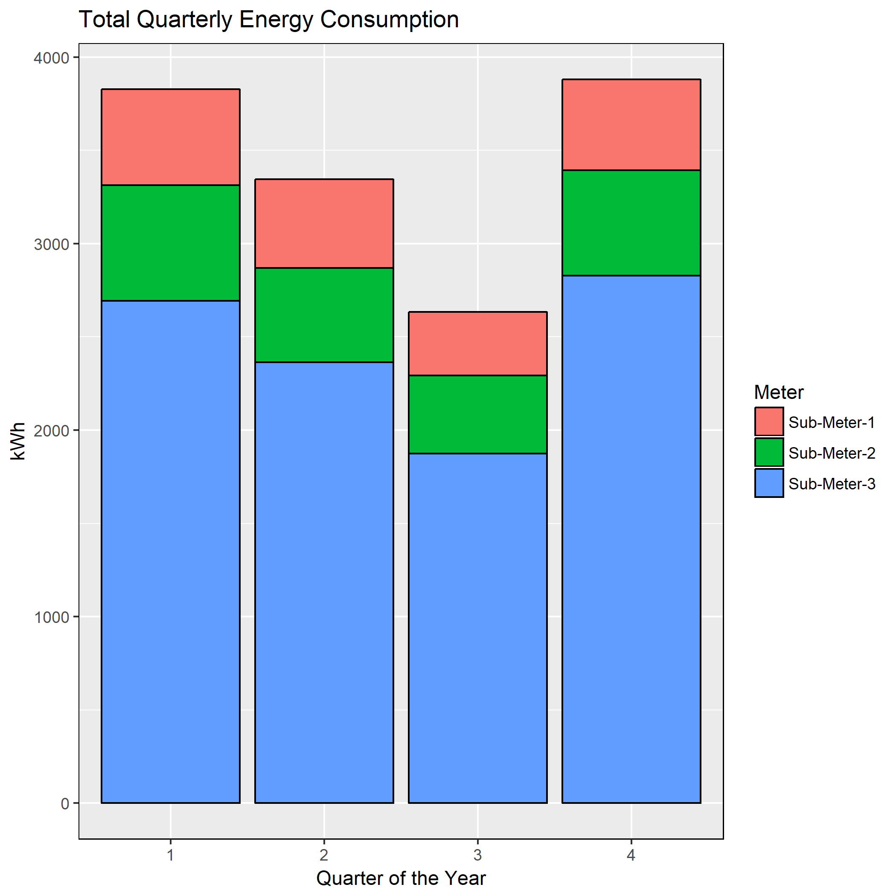
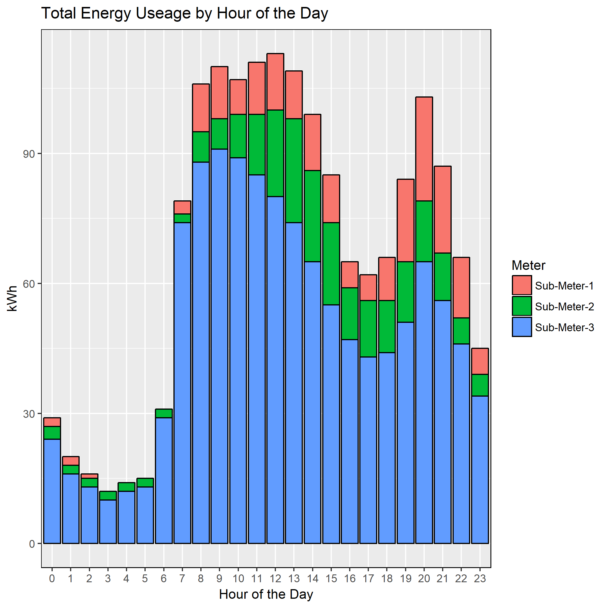
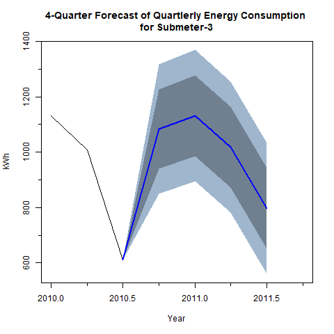

Analysis of Submetered Household Electric Power Usage
================

Abstract
--------

This project is analyzed from the perspective of a data scientist working for an "Internet of Things" analytics consulting firm whose client is a home developer. The client would like to know if insights can be found in the sub-metered energy consumption data set that could be used as an incentive to potential home buyers that may be interested in "smart home" technology.

Turning the business problem into a data science problem, the goal was to find examples of the three deliverables below to support the business objective.

1.  *Sub-metered energy consumption data that provides enough granularity to uncover trends in behavior or appliance performance.*

2.  *Identification of peak energy usage can be identified allowing for the potential to modify behavior to take advantage of off-peak electricity rates.*

3.  *Longer-term patterns of energy usage that can be used to predict future usage with the potential to flag appliance degradation or unusual energy consumption.*

Methods
-------

The 'household\_power\_consumption' data set is available at the [UCI Machine Learning Repository](http://archive.ics.uci.edu/ml/datasets/Individual+household+electric+power+consumption). It consists of time series data with 2,075,259 energy measurements and 9 variables. Measurements were recorded for the 3 submeters every minute for 47 months. The variable definitions are shown in tne table below.

<table class="table table-striped table-hover table-responsive table-bordered" style="font-size: 14px; width: auto !important; margin-left: auto; margin-right: auto;">
<caption style="font-size: initial !important;">
Data Set Feature Definitions
</caption>
<thead>
<tr>
<th style="text-align:left;">
Feature
</th>
<th style="text-align:left;">
Definition
</th>
<th style="text-align:left;">
Sub-Meter-Coverage
</th>
</tr>
</thead>
<tbody>
<tr>
<td style="text-align:left;">
date
</td>
<td style="text-align:left;">
Date format dd/mm/yyyy
</td>
<td style="text-align:left;">
</td>
</tr>
<tr>
<td style="text-align:left;">
time
</td>
<td style="text-align:left;">
time format hh:mm:ss
</td>
<td style="text-align:left;">
</td>
</tr>
<tr>
<td style="text-align:left;">
global\_active\_power
</td>
<td style="text-align:left;">
household global minute-averaged active power (kilowatt)
</td>
<td style="text-align:left;">
</td>
</tr>
<tr>
<td style="text-align:left;">
global\_reactive\_power
</td>
<td style="text-align:left;">
household global minute-averaged reactive power (kilowatt)
</td>
<td style="text-align:left;">
</td>
</tr>
<tr>
<td style="text-align:left;">
voltage
</td>
<td style="text-align:left;">
minute-averaged voltage (volt)
</td>
<td style="text-align:left;">
</td>
</tr>
<tr>
<td style="text-align:left;">
global\_intensity
</td>
<td style="text-align:left;">
household global minute-averaged current intensity (ampere)
</td>
<td style="text-align:left;">
</td>
</tr>
<tr>
<td style="text-align:left;">
sub\_metering\_1
</td>
<td style="text-align:left;">
energy sub-metering No. 1 (watt-hour of active energy)
</td>
<td style="text-align:left;">
kitchen (dishwasher, oven, microwave)
</td>
</tr>
<tr>
<td style="text-align:left;">
sub\_metering\_2
</td>
<td style="text-align:left;">
energy sub-metering No. 2 (watt-hour of active energy)
</td>
<td style="text-align:left;">
laundry room (washing machine, drier, light, refrigerator)
</td>
</tr>
<tr>
<td style="text-align:left;">
sub\_metering\_3
</td>
<td style="text-align:left;">
energy sub-metering No. 3 (watt-hour of active energy)
</td>
<td style="text-align:left;">
electric water heater and air conditioner
</td>
</tr>
</tbody>
</table>
Initial data processing included combining the date and time features into a single DateTime feature and then converting it into the proper class. Visualization of the extent and pattern of missing data showed that when data was missing, it was missing across all features (aside from DateTime). These instances were removed accounting for ~1.25% of the data. Finally a long form of the data set was created to aid visualizations in the exploratory data analysis effort.

Linear regression models were built for the quarterly and monthly time series'. Model fit was assessed by residual analysis.

Examples of visualizations that help support the deliverables described above are shown below.

An example of an identifiable pattern of energy usage is shown with a plot of the total quarterly energy consumption. A trough of energy consumption in Q3 is evident. A plot of the quarterly time series showed that this pattern was repeated over the time frame of the data set.

The ability to identify periods of peak usage allows the potential to modify behavior and shift energy consumption to off-peak hours which may. Below is the pattern of total energy usage by hour of the day. Clear peaks and troughs of engery consumption can be seen.

Energy usage oustide of a predicted range could be used to flag a possible appliance performance issue. Below is the forecasted quarterly energy consumption with 80% and 95% prediction intervals. 

Requirements
------------

Package names and versions used for this analysis can be found in the requirements.txt file.
