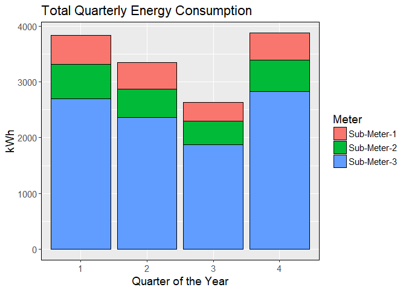
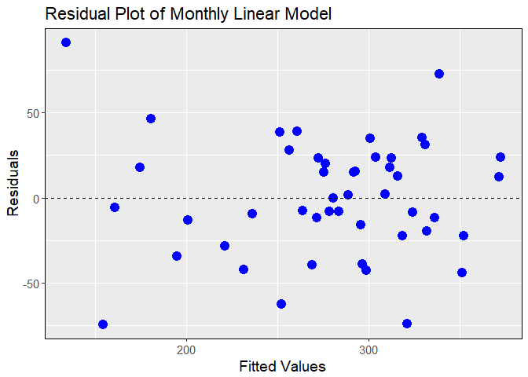
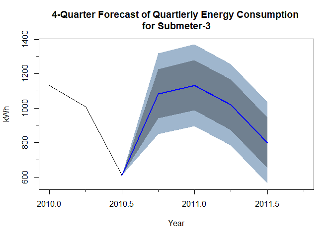

**Analysis of Submetered Household Electric Power Consumption**
================

-   [**Introduction**](#introduction)
-   [**1. Framing the Problem**](#framing-the-problem)
-   [**2. Collect/Load Raw Data**](#collectload-raw-data)
-   [**3. Process the Data**](#process-the-data)
    -   [**3.1 Process Date and Time Features**](#process-date-and-time-features)
    -   [**3.2 Rename Independent Variables**](#rename-independent-variables)
    -   [**3.3 Assess Missing Values**](#assess-missing-values)
    -   [**3.4 Create a Long Form of Data Set**](#create-a-long-form-of-data-set)
-   [**4. Explore the Data**](#explore-the-data)
    -   [**4.1 Visualizations of Energy Usage Across Sub-Meters and Time Periods**](#visualizations-of-energy-usage-across-sub-meters-and-time-periods)
        -   [**4.1.1 Yearly Time Period**](#yearly-time-period)
        -   [**4.1.2 Quarterly Time Period**](#quarterly-time-period)
        -   [**4.1.3 Monthly Time Period**](#monthly-time-period)
        -   [**4.1.4 Week of the Year Time Period**](#week-of-the-year-time-period)
        -   [**4.1.5 Hour of the Day Time Period**](#hour-of-the-day-time-period)
    -   [4.2 Compare High Energy Consumption for Day of Week (Summer & Winter)](#compare-high-energy-consumption-for-day-of-week-summer-winter)
        -   [**Winter**](#winter)
        -   [**Summer**](#summer)
        -   [**Summary Plot**](#summary-plot)
-   [**5. Subset Data Set by Time Periods of Interest**](#subset-data-set-by-time-periods-of-interest)
    -   [**5.1 Quarterly**](#quarterly)
    -   [**5.2 Monthly**](#monthly)
-   [**6. Convert to Time Series and Plot**](#convert-to-time-series-and-plot)
    -   [**6.1 Quarterly Time Series**](#quarterly-time-series)
    -   [**6.2 Monthly Time Series**](#monthly-time-series)
-   [**7. Fit Linear Regression Model to *Quarterly* Time Series**](#fit-linear-regression-model-to-quarterly-time-series)
    -   [**7.1 Fit Model**](#fit-model)
    -   [**7.2 Assess Model Fit**](#assess-model-fit)
        -   [**Fitted vs Actual**](#fitted-vs-actual)
        -   [**Fitted vs Residuals**](#fitted-vs-residuals)
        -   [**Checkresiduals()**](#checkresiduals)
-   [**8. Fit Linear Regression Model to *Monthly* Time Series**](#fit-linear-regression-model-to-monthly-time-series)
    -   [**8.1 Fit Model**](#fit-model-1)
    -   [**8.2 Assess Model Fit**](#assess-model-fit-1)
        -   [**Fitted vs. Actual**](#fitted-vs.-actual)
        -   [**Fitted vs. Residuals**](#fitted-vs.-residuals)
        -   [**Checkresiduals()**](#checkresiduals-1)
-   [**9. Forecast of Energy Consumption**](#forecast-of-energy-consumption)
    -   [**9.1 Quarterly Forecast**](#quarterly-forecast)
    -   [**9.2 Monthly Forecast**](#monthly-forecast)
-   [**10. Summary**](#summary)

**Introduction**
----------------

This project summary is from the perspective of a data scientist working for an "Internet of Things" analytics consulting firm whose client is a home developer. The client would like to know if insights can be found in the sub-metered energy consumption data set that could be used as an incentive to potential home buyers that may be interested in "smart home" technology.

The initial task is to frame the problem or objective. The client's request is purposefully vague, so much thought needs to go into defining the business problem and converting it into a data science problem.

**1. Framing the Problem**
--------------------------

While we don't have a client with which to discuss and fine-tune the business objective, we can imagine what information or insights a homeowner may find valuable. These insights would need to offset the cost of installing submeters, so we'll focus on uncovering potential opportunities for cost-savings.

The high-level business objective is:

*Determine if the installation of sub-metering devices that measure power consumption can translate into economic incentive recommendations for homeowners.*

Turning the business problem into a data science problem, we'll look to find examples of the three deliverables below to support the business objective.

1.  *Sub-metered energy consumption data that provides enough granularity to uncover trends in behavior or appliance performance.*

2.  *Identification of peak energy usage can be identified allowing for the potential to modify behavior to take advantage of off-peak electricity rates.*

3.  *Longer-term patterns of energy usage that can be used to predict future usage with the potential to flag appliance degradation or unusual energy consumption.*

**2. Collect/Load Raw Data**
----------------------------

To interrogate this large time series data set, we'll take advantage of several packages available in R. The tidyverse package bundles very useful packages that are used extensively in this analysis. More information on the tidyverse library can be found in Garret Grolemund's and Hadley Wickham's [R for Data Science](http://r4ds.had.co.nz/).

``` r
#-Load packages
library(caret)  #R modeling workhorse & ggplot2
library(tidyverse)  #Package for tidying data
library(lubridate)  #For working with dates/times of a time series
library(VIM)  #Visualizing and imputing missing values
library(Hmisc)  #for descriptive statistics
library(forecast)  #forcasting package
library(kableExtra)  #fancy table generator
library(broom)  #Tidy statistical summary output
library(knitr)  #report generation
```

We'll use the read\_delim() function contained in the readr package to import the data set. This results in the creation of a tibble which is a data frame that's designed to work with other tidyverse packages. Here the col\_types argument has been used to define column data types as floats or double by setting the column types to 'd'. Missing values will be assigned to '?' for now as a place holder.

``` r
#-Load data set
house_pwr <- read_delim("household_power_consumption.txt", col_names = TRUE, 
    col_types = cols(Global_active_power = "d", Global_reactive_power = "d", 
        Voltage = "d", Global_intensity = "d", Sub_metering_1 = "d", Sub_metering_2 = "d", 
        Sub_metering_3 = "d"), delim = ";", na = "?")
```

With the data loaded, we can now have a look at it with the summary() and head() functions.

``` r
#-Summary statistics for data features
summary(house_pwr)
```

    ##      Date               Time          Global_active_power
    ##  Length:2075259     Length:2075259    Min.   : 0.076     
    ##  Class :character   Class1:hms        1st Qu.: 0.308     
    ##  Mode  :character   Class2:difftime   Median : 0.602     
    ##                     Mode  :numeric    Mean   : 1.092     
    ##                                       3rd Qu.: 1.528     
    ##                                       Max.   :11.122     
    ##                                       NA's   :25979      
    ##  Global_reactive_power    Voltage      Global_intensity Sub_metering_1  
    ##  Min.   :0.000         Min.   :223.2   Min.   : 0.200   Min.   : 0.000  
    ##  1st Qu.:0.048         1st Qu.:239.0   1st Qu.: 1.400   1st Qu.: 0.000  
    ##  Median :0.100         Median :241.0   Median : 2.600   Median : 0.000  
    ##  Mean   :0.124         Mean   :240.8   Mean   : 4.628   Mean   : 1.122  
    ##  3rd Qu.:0.194         3rd Qu.:242.9   3rd Qu.: 6.400   3rd Qu.: 0.000  
    ##  Max.   :1.390         Max.   :254.2   Max.   :48.400   Max.   :88.000  
    ##  NA's   :25979         NA's   :25979   NA's   :25979    NA's   :25979   
    ##  Sub_metering_2   Sub_metering_3  
    ##  Min.   : 0.000   Min.   : 0.000  
    ##  1st Qu.: 0.000   1st Qu.: 0.000  
    ##  Median : 0.000   Median : 1.000  
    ##  Mean   : 1.299   Mean   : 6.458  
    ##  3rd Qu.: 1.000   3rd Qu.:17.000  
    ##  Max.   :80.000   Max.   :31.000  
    ##  NA's   :25979    NA's   :25979

From the output of the summary function we can see that there are 2,075,259 observations. We can also see from the summary statistics of the features that there are 25,979 missing values (NA's).

``` r
#-Look at top several rows of data set
head(house_pwr)
```

    ## # A tibble: 6 x 9
    ##   Date       Time     Global_~ Global_~ Volta~ Globa~ Sub_m~ Sub_m~ Sub_m~
    ##   <chr>      <time>      <dbl>    <dbl>  <dbl>  <dbl>  <dbl>  <dbl>  <dbl>
    ## 1 16/12/2006 17:24:00     4.22    0.418    235   18.4      0   1.00   17.0
    ## 2 16/12/2006 17:25:00     5.36    0.436    234   23.0      0   1.00   16.0
    ## 3 16/12/2006 17:26:00     5.37    0.498    233   23.0      0   2.00   17.0
    ## 4 16/12/2006 17:27:00     5.39    0.502    234   23.0      0   1.00   17.0
    ## 5 16/12/2006 17:28:00     3.67    0.528    236   15.8      0   1.00   17.0
    ## 6 16/12/2006 17:29:00     3.52    0.522    235   15.0      0   2.00   17.0

The table from the output of the head() function on the house\_pwr tibble shows the first several rows of the data set along with the data type. The definitions of the features are provided below for reference. The table also shows what appliances are on the electrical circuits that are monitored by each of the sub-meters.

``` r
#-Read in CSV file of data feature definitions
def_table <- read.csv("Energy_submeter_defs.csv")

#-create table of feature definitions
kable(def_table, col.names = c("Feature", "Definition", "Sub-Meter-Coverage"), 
    caption = "Data Set Feature Definitions") %>% kable_styling(bootstrap_options = c("striped", 
    "hover", "responsive", "bordered"), full_width = F, font_size = 14)
```

<table class="table table-striped table-hover table-responsive table-bordered" style="font-size: 14px; width: auto !important; margin-left: auto; margin-right: auto;">
<caption style="font-size: initial !important;">
Data Set Feature Definitions
</caption>
<thead>
<tr>
<th style="text-align:left;">
Feature
</th>
<th style="text-align:left;">
Definition
</th>
<th style="text-align:left;">
Sub-Meter-Coverage
</th>
</tr>
</thead>
<tbody>
<tr>
<td style="text-align:left;">
date
</td>
<td style="text-align:left;">
Date format dd/mm/yyyy
</td>
<td style="text-align:left;">
</td>
</tr>
<tr>
<td style="text-align:left;">
time
</td>
<td style="text-align:left;">
time format hh:mm:ss
</td>
<td style="text-align:left;">
</td>
</tr>
<tr>
<td style="text-align:left;">
global\_active\_power
</td>
<td style="text-align:left;">
household global minute-averaged active power (kilowatt)
</td>
<td style="text-align:left;">
</td>
</tr>
<tr>
<td style="text-align:left;">
global\_reactive\_power
</td>
<td style="text-align:left;">
household global minute-averaged reactive power (kilowatt)
</td>
<td style="text-align:left;">
</td>
</tr>
<tr>
<td style="text-align:left;">
voltage
</td>
<td style="text-align:left;">
minute-averaged voltage (volt)
</td>
<td style="text-align:left;">
</td>
</tr>
<tr>
<td style="text-align:left;">
global\_intensity
</td>
<td style="text-align:left;">
household global minute-averaged current intensity (ampere)
</td>
<td style="text-align:left;">
</td>
</tr>
<tr>
<td style="text-align:left;">
sub\_metering\_1
</td>
<td style="text-align:left;">
energy sub-metering No. 1 (watt-hour of active energy)
</td>
<td style="text-align:left;">
kitchen (dishwasher, oven, microwave)
</td>
</tr>
<tr>
<td style="text-align:left;">
sub\_metering\_2
</td>
<td style="text-align:left;">
energy sub-metering No. 2 (watt-hour of active energy)
</td>
<td style="text-align:left;">
laundry room (washing machine, drier, light, refrigerator)
</td>
</tr>
<tr>
<td style="text-align:left;">
sub\_metering\_3
</td>
<td style="text-align:left;">
energy sub-metering No. 3 (watt-hour of active energy)
</td>
<td style="text-align:left;">
electric water heater and air conditioner
</td>
</tr>
</tbody>
</table>
**3. Process the Data**
-----------------------

In this section, we'll go over the data processing steps used to get the data ready for exploratory data analysis and modeling.

### **3.1 Process Date and Time Features**

There are many packages and functions in R that facilitate analyzing and plotting time series objects. To take advantage of these, we'll start by combining the Date and Time features to create a 'DateTime' feature using the unite() function from tidyr. By default, the original features are removed leaving the newly-created column.
The next step is to address the data type of the new 'DateTime' feature. After uniting the columns, the DateTime feature is of the character class. We'll use the as.POSIXct() function to convert it into the proper class using the format argument to describe the format of the date-time feature. The cryptic coding used for the format is explained in R's help section (type ?strptime).

``` r
#-Create new DateTime feature by combining Date and Time 
house_pwr <- unite(house_pwr, Date, Time, col = "DateTime", sep = " ")

#-Convert data type of new DateTime feature
house_pwr$DateTime <- as.POSIXct(house_pwr$DateTime, format = "%d/%m/%Y %T", 
    tz = "GMT")

#-Check class of new DateTime feature
class(house_pwr$DateTime)
```

    ## [1] "POSIXct" "POSIXt"

Now that the DateTime feature has been converted to the proper format, we can use the range() function to understand the timeframe that's covered by the data.

``` r
#-check range of time covered by data set
range(house_pwr$DateTime)
```

    ## [1] "2006-12-16 17:24:00 GMT" "2010-11-26 21:02:00 GMT"

The output tells us that the data set contains energy measurements starting on Dec 16, 2006 and ending on Nov.26, 2010. Since 2006 contains only two weeks of data, the data set is filtered to remove data for 2006.

``` r
#-remove data from year 2006
house_pwr <- filter(house_pwr, year(DateTime) != 2006)
```

### **3.2 Rename Independent Variables**

We can truncate/rename some of the features by selecting columns by their index and assigning new names.

``` r
#-change feature names
colnames(house_pwr)[2] <- "Glbl_actvPwr"
colnames(house_pwr)[3] <- "Glbl_ractvPwr"
colnames(house_pwr)[6] <- "Sub-Meter-1"
colnames(house_pwr)[7] <- "Sub-Meter-2"
colnames(house_pwr)[8] <- "Sub-Meter-3"
```

### **3.3 Assess Missing Values**

We noticed in the summary of the data set that there were missing values. To get a sense of how these missing values are distributed in the data, we'll use the aggr() function of the VIM package to generate a visualization.

``` r
#-Visualize extent and pattern of missing data
aggr_plot <- aggr(house_pwr, col = c("navyblue", "red"), numbers = TRUE, sortVars = TRUE, 
    labels = names(house_pwr), cex.axis = 0.7, gap = 3, ylab = c("Histogram of missing data", 
        "Pattern"), digits = 2)
```


    ## 
    ##  Variables sorted by number of missings: 
    ##          Variable     Count
    ##      Glbl_actvPwr 0.0126506
    ##     Glbl_ractvPwr 0.0126506
    ##           Voltage 0.0126506
    ##  Global_intensity 0.0126506
    ##       Sub-Meter-1 0.0126506
    ##       Sub-Meter-2 0.0126506
    ##       Sub-Meter-3 0.0126506
    ##          DateTime 0.0000000

We can quickly determine by looking at the charts that the missing values aren't scattered randomly throughout the data. Rather, entire rows are missing data. Thus, the decision to remove the rows is an easy one since no information is lost. The na.omit() function takes care of that by removing entire rows with missing values.

``` r
#-Remove rows with NA's
house_pwr <- na.omit(house_pwr)

#-Check that there are no missing values remaining
sum(is.na(house_pwr))
```

    ## [1] 0

A quick check of our work by summing the NA count confirms that the missing values were removed.

### **3.4 Create a Long Form of Data Set**

In the data set's current form, each observation or row contains data for each of the sub-meters. To aid the visualization of the submeter data on the same chart, the gather() function is used to create a new column 'Meter' which contains the names of the submeters. The observed values for the submeters are placed in the newly-created 'Watt\_hr' column.

``` r
#-Create long form of data set
house_pwr_tidy <- house_pwr %>% gather(Meter, Watt_hr, `Sub-Meter-1`, `Sub-Meter-2`, 
    `Sub-Meter-3`)
```

The Meter feature is converted to a factor and the data types are checked with the glimpse function to ensure everything is as it should be before moving on to exploratory data analysis.

``` r
#-Convert meter feature to categorical
house_pwr_tidy$Meter <- factor(house_pwr_tidy$Meter)

#-peak at data 
glimpse(house_pwr_tidy)
```

    ## Observations: 6,081,864
    ## Variables: 7
    ## $ DateTime         <dttm> 2007-01-01 00:00:00, 2007-01-01 00:01:00, 20...
    ## $ Glbl_actvPwr     <dbl> 2.580, 2.552, 2.550, 2.550, 2.554, 2.550, 2.5...
    ## $ Glbl_ractvPwr    <dbl> 0.136, 0.100, 0.100, 0.100, 0.100, 0.100, 0.0...
    ## $ Voltage          <dbl> 241.97, 241.75, 241.64, 241.71, 241.98, 241.8...
    ## $ Global_intensity <dbl> 10.6, 10.4, 10.4, 10.4, 10.4, 10.4, 10.4, 10....
    ## $ Meter            <fctr> Sub-Meter-1, Sub-Meter-1, Sub-Meter-1, Sub-M...
    ## $ Watt_hr          <dbl> 0, 0, 0, 0, 0, 0, 0, 0, 0, 0, 0, 0, 0, 0, 0, ...

**4. Explore the Data**
-----------------------

### **4.1 Visualizations of Energy Usage Across Sub-Meters and Time Periods**

Keeping the business objective in mind, the initial exploratory analysis will be looking for any trends or patterns in the data that would be of value to a homeowner. Since this is a large data set and there are quite a few visualizations to generate, the data will be subset and visualized without saving to a data frame or tibble object. This is accomplished using the pipe operator (%&gt;%) which allows us to chain together a sequence of coded operations. Once the more informative time periods are identified, data sets of subset time periods can be generated for the more in-depth time series analysis.

#### **4.1.1 Yearly Time Period**

We'll start by visualizing the least granular of time periods (yearly) and drill down from there. Since data from year 2010 stopped in November, a proportion plot will be used to allow for fairer comparisons between years. Note the advantage of using the long form of the data set where the 'fill=Meter' argument in the ggplot() function makes easy work of coloring the stacked bar plot by submeter.

``` r
#-Year_Proportional Plot
house_pwr_tidy %>% group_by(year(DateTime), Meter) %>% summarise(sum = sum(Watt_hr)) %>% 
    ggplot(aes(x = factor(`year(DateTime)`), sum, group = Meter, fill = Meter)) + 
    labs(x = "Year", y = "Proportion of Energy Useage") + ggtitle("Proportion of Total Yearly Energy Consumption") + 
    geom_bar(stat = "identity", position = "fill", color = "black") + theme(panel.border = element_rect(colour = "black", 
    fill = NA))
```


Of note from the yearly proportion plot is that there is a clear trend of increasing energy consumption on sub-meter-3 (electric water heater/ air conditioner). A trend such as this could indicate erosion of performance of an appliance which would have to run longer and/or more frequently to maintain a temperature set point. A high-level recommendation to the client would be to provide the ability to overlay an average temperature line plot to help the homeowner put heating/cooling energy consumption in context. In addition, since sub-meter 3 accounts for most of the sub-metered energy consumption, a homeowner would likely find value in knowing how the water heater and air conditioner contribute to that total. This would require a separate sub-meter for high energy consuming appliances.

#### **4.1.2 Quarterly Time Period**

Looking at total energy consumption by quarter over the 2007-2009 timeframe shows a clear trend of decreasing energy usage with a trough in Q3 and rebounding in Q4.

``` r
#-Quarterly bar plot
house_pwr_tidy %>% filter(year(DateTime) < 2010) %>% group_by(quarter(DateTime), 
    Meter) %>% summarise(sum = round(sum(Watt_hr/1000), 3)) %>% ggplot(aes(x = factor(`quarter(DateTime)`), 
    y = sum)) + labs(x = "Quarter of the Year", y = "kWh") + ggtitle("Total Quarterly Energy Consumption") + 
    geom_bar(stat = "identity", aes(fill = Meter), color = "black") + theme(panel.border = element_rect(colour = "black", 
    fill = NA))
```



#### **4.1.3 Monthly Time Period**

The same trough of energy consumption observed in the quarterly data is observed with more granularity with aggregated monthly data.

``` r
#-Monthly bar chart
house_pwr_tidy %>% filter(year(DateTime) < 2010) %>% mutate(Month = lubridate::month(DateTime, 
    label = TRUE, abbr = TRUE)) %>% group_by(Month, Meter) %>% summarise(sum = round(sum(Watt_hr)/1000), 
    3) %>% ggplot(aes(x = factor(Month), y = sum)) + labs(x = "Month of the Year", 
    y = "kWh") + ggtitle("Total Energy Useage by Month of the Year") + geom_bar(stat = "identity", 
    aes(fill = Meter), colour = "black") + theme(panel.border = element_rect(colour = "black", 
    fill = NA))
```


#### **4.1.4 Week of the Year Time Period**

Additional patterns of energy consumption become apparent when looking at energy usage by week of the year. In addition to the trough in the summer months, a recurring pattern of noticeably lower energy consumption occurs roughly every 8 or 9 weeks starting with week 1.

``` r
#-Week of the year- bar plot
house_pwr_tidy %>% group_by(week(DateTime), Meter) %>% summarise(sum = sum(Watt_hr/1000)) %>% 
    ggplot(aes(x = factor(`week(DateTime)`), y = sum)) + labs(x = "Week of the Year", 
    y = "kWh") + ggtitle("Total Energy Usage by Week of the Year") + theme(axis.text.x = element_text(angle = 90)) + 
    geom_bar(stat = "identity", aes(fill = Meter), colour = "black") + theme(panel.border = element_rect(colour = "black", 
    fill = NA))
```


#### **4.1.5 Hour of the Day Time Period**

Finally, drilling down to the hour of the day shows clear trends in energy consumption. The lowest energy usage is, not surprisingly, in the early morning hours where all sub-meters reach their minimum. If it is determined that the local electricity provider offers off-peak rates, this chart would identify opportunities for the homeowner to shift energy consumption to off-peak hours. For example, a timer on the washer machine and/or the dishwasher could be set to run after midnight.

``` r
#-Hour of day bar chart
house_pwr_tidy %>% filter(month(DateTime) == c(1, 2, 11, 12)) %>% group_by(hour(DateTime), 
    Meter) %>% summarise(sum = round(sum(Watt_hr)/1000), 3) %>% ggplot(aes(x = factor(`hour(DateTime)`), 
    y = sum)) + labs(x = "Hour of the Day", y = "kWh") + ggtitle("Total Energy Useage by Hour of the Day") + 
    geom_bar(stat = "identity", aes(fill = Meter), colour = "black") + theme(panel.border = element_rect(colour = "black", 
    fill = NA))
```


### 4.2 Compare High Energy Consumption for Day of Week (Summer & Winter)

Insights gleaned from energy consumption by day of the week could be of value to a homeowner as it can readily be related to homeowner energy consumption behaviors. This in turn provides potential opportunities for behavior modification. We'll compare 8-week periods of high energy consumption during the winter and summer seasons.

#### **Winter**

``` r
#-Filter and plot data for weeks 1-8
house_pwr_tidy %>% filter(week(DateTime) == c(1:8)) %>% mutate(Day = lubridate::wday(DateTime, 
    label = TRUE, abbr = TRUE)) %>% group_by(Day, Meter) %>% summarise(sum = sum(Watt_hr/1000)) %>% 
    ggplot(aes(x = factor(Day), y = sum)) + labs(x = "Day of the Week", y = "kWh") + 
    ylim(0, 85) + ggtitle("Total Energy Useage by Day for Weeks of High Consumption \n in Winter Months") + 
    geom_bar(stat = "identity", aes(fill = Meter), colour = "black") + theme(panel.border = element_rect(colour = "black", 
    fill = NA))
```

 There appears to be a trend of increasing energy usage on sub-meter 3 as the week progresses. Peak kitchen usage seems to happen on the weekends (sub-meter 1) while peak laundry days appears to be on Saturday, Sunday and Wednesday (sub-meter 2). Of note is that energy usage of submeter 3 is driven by the electric water heater and not the air conditioner as the data is from the winter months. Let's see how this compares to consumption trends during peak consumption during warmer months.

#### **Summer**

``` r
#-Filter and plot data for weeks 18-25
house_pwr_tidy %>% filter(week(DateTime) == c(18:25)) %>% mutate(Day = lubridate::wday(DateTime, 
    label = TRUE, abbr = TRUE)) %>% group_by(Day, Meter) %>% summarise(sum = sum(Watt_hr/1000)) %>% 
    ggplot(aes(x = factor(Day), y = sum)) + labs(x = "Day of the Week", y = "kWh") + 
    ylim(0, 85) + ggtitle("Total Energy Useage by Day for Weeks of High Consumption\nin Summer Months") + 
    geom_bar(stat = "identity", aes(fill = Meter), colour = "black") + theme(panel.border = element_rect(colour = "black", 
    fill = NA))
```

 Interestingly total consumption on submeter 3 is less in the summer months than in the winter months. As a reminder, the air conditioner and the electric water heater are on the circuit monitored by submeter 3. This suggests that the increase in consumption in the winter as measured by submeter 3 may be due to a poorly insulated water heater or a water heater in a poorly insulated space.

#### **Summary Plot**

To highlight and more readily compare energy consumption on submeter 3 in summer and winter seasons, we'll prepare a line chart.

For the winter time frame, we'll subset the data for the first 8 weeks of a year and only include data for submeter 3.

``` r
#-Subset data for weeks 1-8 and assign to variable w
w <- house_pwr_tidy %>% filter(week(DateTime) == c(1:8)) %>% filter(Meter == 
    "Sub-Meter-3") %>% mutate(Day = lubridate::wday(DateTime, label = TRUE, 
    abbr = TRUE)) %>% group_by(Day, Meter) %>% summarise(sum = sum(Watt_hr/1000))
```

Next we'll subset the data to include data for submeter 3 during an 8-week stretch in the summer months.

``` r
#-Subset data for weeks 18-25 and assign to variable ww
ww <- house_pwr_tidy %>% filter(week(DateTime) == c(18:25)) %>% filter(Meter == 
    "Sub-Meter-3") %>% mutate(Day = lubridate::wday(DateTime, label = TRUE, 
    abbr = TRUE)) %>% group_by(Day, Meter) %>% summarise(sum = sum(Watt_hr/1000))
```

Finally, we'll overlay the line plots of the data to highlight what appears to be conuterintuitive energy consumption on submeter 3.

``` r
#-Overlay line plots of the two 8-week time periods
ggplot(w) + labs(x = "Day of the Week", y = "kWh") + ylim(0, 65) + ggtitle("Total Energy Useage on Submeter 3 for High\n Consumption Period in Winter and Summer Months") + 
    geom_line(aes(x = Day, y = sum, group = 1, colour = "winter")) + geom_line(data = ww, 
    aes(x = Day, y = sum, group = 1, color = "summer")) + scale_colour_manual(values = c(winter = "blue", 
    summer = "red")) + labs(colour = "Season") + guides(colour = guide_legend(reverse = TRUE)) + 
    theme(panel.border = element_rect(colour = "black", fill = NA))
```

 The fact that there may be a reasonable explanation for this pattern of energy consumption shouldn't concern us. The primary concern is to demonstrate to the client that potentially actionable insights *can* be uncovered in submetered energy data.

**5. Subset Data Set by Time Periods of Interest**
--------------------------------------------------

Through exploratory data analysis, we were able to identify trends in energy consumption leading to insights that had the potential to save money for a homeowner through behavior modification or by flagging an inefficient appliance. An additional opportunity to monitor the health of an appliance would be to compare actual energy consumption to projected consumption. If actual consumption fell out of the projected range, the homeowner could be alerted that maintenance may be required and thereby avoiding a costly and disruptive failure of an appliance. To do this, we'll convert a subset of the data to a time series object and then use the forecast() function to predict energy consumption.

### **5.1 Quarterly**

We'll take advantage of the functions group\_by() and summarise() from the dplyr package to make easy work of subsetting our time series data. The lubridate package also makes it straightforward to parse dates in our group\_by() function below. The summarise() function then sums the values for the submeters after converting to kWh from Wh. Finally, the head() function displays the first several rows of our data set to confirm everything worked as planned.

``` r
#-Subset data by quarter and summarise total usage across the 3 submeters
housePWR_qtr <- house_pwr %>% group_by(year(DateTime), quarter(DateTime)) %>% 
    summarise(Sub_Meter_1 = round(sum(`Sub-Meter-1`/1000), 3), Sub_Meter_2 = round(sum(`Sub-Meter-2`/1000), 
        3), Sub_Meter_3 = round(sum(`Sub-Meter-3`/1000), 3))

#-Look at top several rows of new quarterly data set 
head(housePWR_qtr)
```

    ## # A tibble: 6 x 5
    ## # Groups: year(DateTime) [2]
    ##   `year(DateTime)` `quarter(DateTime)` Sub_Meter_1 Sub_Meter_2 Sub_Meter_3
    ##              <int>               <int>       <dbl>       <dbl>       <dbl>
    ## 1             2007                   1         165         249         890
    ## 2             2007                   2         177         180         608
    ## 3             2007                   3         132         181         607
    ## 4             2007                   4         168         245         918
    ## 5             2008                   1         165         199         848
    ## 6             2008                   2         169         193         876

### **5.2 Monthly**

By simply changing how the date is parsed in the group\_by() function of the quarterly time series, we can get our desired monthly time series. Again, to convince ourselves that we subset the data as planned, we'll look at the first several rows of our resulting data set.

``` r
#-Subset data by month and summarise total energy usage across submeters
housePWR_mnth <- house_pwr %>% group_by(year(DateTime), month(DateTime)) %>% 
    summarise(Sub_Meter_1 = round(sum(`Sub-Meter-1`/1000), 3), Sub_Meter_2 = round(sum(`Sub-Meter-2`/1000), 
        3), Sub_Meter_3 = round(sum(`Sub-Meter-3`/1000), 3))

#-Look at top several rows of new monthly data set
head(housePWR_mnth)
```

    ## # A tibble: 6 x 5
    ## # Groups: year(DateTime) [1]
    ##   `year(DateTime)` `month(DateTime)` Sub_Meter_1 Sub_Meter_2 Sub_Meter_3
    ##              <int>             <int>       <dbl>       <dbl>       <dbl>
    ## 1             2007                 1        56.4        79.3         330
    ## 2             2007                 2        47.6        64.6         270
    ## 3             2007                 3        60.8       105           290
    ## 4             2007                 4        42.1        38.4         190
    ## 5             2007                 5        75.7        72.1         229
    ## 6             2007                 6        59.7        69.9         189

**6. Convert to Time Series and Plot**
--------------------------------------

To convert our data to a time series object, we'll use R's ts() function on our subset time series data.

### **6.1 Quarterly Time Series**

It's important to set the frequency argument to the correct value. For a quarterly time series, the value is set to 4.

``` r
#-Create quarterly time series 
housePWR_qtrTS <- ts(housePWR_qtr[, 3:5], frequency = 4, start = c(2007, 1), 
    end = c(2010, 3))

#-Plot quarterly time series
plot(housePWR_qtrTS, plot.type = "s", col = c("red", "green", "blue"), main = "Total Quarterly kWh Consumption", 
    xlab = "Year", ylab = "kWh")
minor.tick(nx = 4)

#-Create legend
b <- c("Sub-meter-1", "Sub-meter-2", "Sub-meter-3")
legend("topleft", b, col = c("red", "green", "blue"), lwd = 2, bty = "n")
```

 We can see that the mid-year trough of energy consumption observed in the quarterly bar chart does indeed repeat over time.

### **6.2 Monthly Time Series**

Now we'll convert our data subset by month into a time series object by setting the frequency to 12.

``` r
#-Create monthly time series
housePWR_mnthTS <- ts(housePWR_mnth[, 3:5], frequency = 12, start = c(2007, 
    1), end = c(2010, 11))

#-Plot monthly time series
plot(housePWR_mnthTS, plot.type = "s", xlim = c(2007, 2011), col = c("red", 
    "green", "blue"), main = "Total Monthly kWh Consumption", xlab = "Year/Month", 
    ylab = "kWh")
minor.tick(nx = 12)

#-Create legend
b <- c("Sub-meter-1", "Sub-meter-2", "Sub-meter-3")
legend("topleft", b, col = c("red", "green", "blue"), lwd = 2, bty = "n")
```

 We can see a seasonal pattern over the years with trough of energy usage in the summer that is most-pronounced with submeter 3.

**7. Fit Linear Regression Model to *Quarterly* Time Series**
-------------------------------------------------------------

For this section the focus will be on submeter 3 which accounts for a majority of the total submetered energy consumption. We will first fit a linear model to our quarterly and monthly data. Before using these models to forecast future energy usage, we'll investigate some of the assumptions of a linear regression model to determine if use of a linear model is appropriate for our subset time series data sets.

### **7.1 Fit Model**

We'll start by fitting a linear model to our quarterly times series including the trend and seasonal components. We can get a quick assessment of the model by looking at the output. To make the model output more readable and 'tidy', we'll take advantage of the broom package. In this first example, I've left in the output of the summary() function to highlight what the broom package accomplishes.

``` r
#-Fit linear model to quarterly time series for submeter 3
fit1 <- tslm(housePWR_qtrTS[, 3] ~ trend + season)

summary(fit1)
```

    ## 
    ## Call:
    ## tslm(formula = housePWR_qtrTS[, 3] ~ trend + season)
    ## 
    ## Residuals:
    ##     Min      1Q  Median      3Q     Max 
    ## -129.44  -54.99   20.07   52.51   90.74 
    ## 
    ## Coefficients:
    ##             Estimate Std. Error t value Pr(>|t|)    
    ## (Intercept)  833.098     54.801  15.202 3.07e-08 ***
    ## trend         17.573      5.066   3.468 0.006037 ** 
    ## season2     -131.001     59.300  -2.209 0.051638 .  
    ## season3     -369.922     59.946  -6.171 0.000105 ***
    ## season4      -30.684     64.018  -0.479 0.642035    
    ## ---
    ## Signif. codes:  0 '***' 0.001 '**' 0.01 '*' 0.05 '.' 0.1 ' ' 1
    ## 
    ## Residual standard error: 83.56 on 10 degrees of freedom
    ## Multiple R-squared:  0.8377, Adjusted R-squared:  0.7728 
    ## F-statistic: 12.91 on 4 and 10 DF,  p-value: 0.0005834

The summary() output provides everything we need to do a quick assessment of the model but it's not terribly easy to read. The glance() and tidy() functions of the broom package on the other hand provide tabular outputs.

``` r
#-One-line statistical summary for quarterly linear model.
glance(fit1)
```

    ##   r.squared adj.r.squared    sigma statistic      p.value df    logLik
    ## 1 0.8377499     0.7728499 83.55659  12.90831 0.0005834279  5 -84.62595
    ##        AIC      BIC deviance df.residual
    ## 1 181.2519 185.5002 69817.03          10

The glance() function provides a one-row summary of the model that includes various error measures. One of the first things to look at it is the *p*-value for the F-statistic (*statistic* in the table). We do have a significant *p*-value which tells us that at least one of the predictors or the predictors jointly are statistically significant.

``` r
#-Tabular summary of quarterly linear model.
tidy(fit1)
```

    ##          term   estimate std.error  statistic      p.value
    ## 1 (Intercept)  833.09819 54.801087 15.2022203 3.073908e-08
    ## 2       trend   17.57254  5.066362  3.4684737 6.036505e-03
    ## 3     season2 -131.00104 59.300250 -2.2091145 5.163805e-02
    ## 4     season3 -369.92209 59.946006 -6.1709213 1.053891e-04
    ## 5     season4  -30.68388 64.018187 -0.4792994 6.420348e-01

The output from the tidy() function tabulates the coefficient estimates with the corresponding standard error, the t-value from the t-test (*statistic* in table), and the *p*-value of the t-value.

### **7.2 Assess Model Fit**

There are several elements in the fit1 object that can help us evaluate how well our linear regression model fits the data.

#### **Fitted vs Actual**

For instance, we can plot the fitted values vs. the actual values to visualize the relationship.

``` r
#-Plot fitted vs actual for quarterly linear model.
ggplot(fit1, aes(x = fit1$fitted.values, y = housePWR_qtrTS[, 3])) + geom_point(color = "blue", 
    size = 4) + labs(x = "Fitted Value", y = "Actual") + geom_abline(intercept = 0, 
    slope = 1, linetype = "dashed") + ggtitle("Fitted vs. Actual Values for Quarterly Linear Model") + 
    theme(panel.border = element_rect(colour = "black", fill = NA))
```

    ## Don't know how to automatically pick scale for object of type ts. Defaulting to continuous.
    ## Don't know how to automatically pick scale for object of type ts. Defaulting to continuous.

 The dashed line represents a 1:1 relationship between fitted and actual values. The closer a point is to the dashed line, the more accurately the model predicted the fitted value. In this case, the fitted values appear to follow the line reasonably well. The distance the fitted value is above or below the line is the error or residual. One way to assess this is with a residual plot where the fitted vs. residuals are plotted.

#### **Fitted vs Residuals**

We can also plot the fitted values vs. the residuals.

``` r
#-Plot fitted vs residuals for quarterly linear model.
ggplot(fit1, aes(x = fit1$fitted.values, y = fit1$residuals)) + geom_point(color = "blue", 
    size = 4) + labs(x = "Fitted Values", y = "Residuals") + geom_hline(yintercept = 0, 
    linetype = "dashed") + ggtitle("Residuals Plot of Quarterly Linear Model") + 
    theme(panel.border = element_rect(colour = "black", fill = NA))
```

    ## Don't know how to automatically pick scale for object of type ts. Defaulting to continuous.
    ## Don't know how to automatically pick scale for object of type ts. Defaulting to continuous.

 Any patterns in the residual plot would suggest a non-linear relationship. However, the random scatterplot appearance of the residual plot suggests that the linear model fits our data well.

#### **Checkresiduals()**

Finally, we'll use the checkresiduals() function to check several of the assumptions that are made with a time series linear regression model. Namely, the distribution of the residuals is normal and centered around zero, there is homoscedasticity or constant variance of error over time, and there is no correlation between errors.

``` r
#-Summary analysis of residuals for quarterly linear model
checkresiduals(fit1)
```


    ## 
    ##  Breusch-Godfrey test for serial correlation of order up to 8
    ## 
    ## data:  Residuals from Linear regression model
    ## LM test = 13.444, df = 8, p-value = 0.09747

The top chart from the output of the checkresiduals() function shows the residuals over time. The line plot shows a pattern that is roughly constant over time which supports the assumption of homoscedasticity. The distribution of residuals is shown in the bottom right with an overlaid normal distribution density in red. The distribution doesn't stray too far from normal so no obvious problems there. The chart on the bottom left is the result of the autocorrelation function which tests for correlation between errors at different time periods or lags. The dashed blue lines represent the level for statistical significance and we can see that none of the lags reach that level. Finally, the function also does a Breusch-Godfrey test which is a hypothesis test for the correlation of errors. The null hypothesis is that the errors are not autocorrelated. The *p*-value for the result of this test is 0.097 which is above the typical 0.05 threshold. Thus, there is not enough evidence to reject the null hypothesis that states there is no autocorrelation in the errors.

**8. Fit Linear Regression Model to *Monthly* Time Series**
-----------------------------------------------------------

Again, focusing on submeter 3, we'll fit a linear model to the monthly time series and then assess how well our model fits the data.

### **8.1 Fit Model**

As we did with the quarterly time series, we'll fit a linear regression model to the monthly time series that includes both trend and seasonal components. Again, we'll use elements of the broom package to provide

``` r
#-Fit linear model to montly time series for submeter 3
fit2 <- tslm(housePWR_mnthTS[, 3] ~ trend + season)

#-One-row statistical summary of monthly linear model
glance(fit2)
```

    ##   r.squared adj.r.squared    sigma statistic      p.value df   logLik
    ## 1 0.7301864     0.6349581 40.33633  7.667745 1.292759e-06 13 -232.852
    ##       AIC     BIC deviance df.residual
    ## 1 493.704 519.606 55318.65          34

The *p*-value for the F-statistic is statistically significant which tells us that at least one of the predictors or the predictors jointly are statistically significant.

### **8.2 Assess Model Fit**

We'll use several elements in the fit2 model object to assess how well our linear regression model fits the monthly time series.

#### **Fitted vs. Actual**

We'll start by looking at a plot of the fitted vs. actual values.

``` r
#-Plot fitted vs actual for monthly linear model

ggplot(fit2, aes(x = fit2$fitted.values, y = housePWR_mnthTS[, 3])) + geom_point(color = "blue", 
    size = 4) + labs(x = "Fitted Value", y = "Actual") + geom_abline(intercept = 0, 
    slope = 1, linetype = "dashed") + ggtitle("Fitted vs. Actual Values for Monthly Linear Model") + 
    theme(panel.border = element_rect(colour = "black", fill = NA))
```

    ## Don't know how to automatically pick scale for object of type ts. Defaulting to continuous.
    ## Don't know how to automatically pick scale for object of type ts. Defaulting to continuous.

 The dashed line represents a 1:1 relationship between fitted and actual values. The closer a point is to the dashed line, the more accurately the model predicted the fitted value. In this case, the fitted values appear to follow the line reasonably well. The distance the fitted value is above or below the line is the error or residual.

#### **Fitted vs. Residuals**

Next, we'll look for any patterns in the fitted vs. residuals plot that would be cause for concern.

``` r
#-Plot fitted vs residuals for monthly linear model

ggplot(fit2, aes(x = fit2$fitted.values, y = fit2$residuals)) + geom_point(color = "blue", 
    size = 4) + labs(x = "Fitted Values", y = "Residuals") + geom_hline(yintercept = 0, 
    linetype = "dashed") + ggtitle("Residual Plot of Monthly Linear Model") + 
    theme(panel.border = element_rect(colour = "black", fill = NA))
```

    ## Don't know how to automatically pick scale for object of type ts. Defaulting to continuous.
    ## Don't know how to automatically pick scale for object of type ts. Defaulting to continuous.

 There don't appear to be any patterns in the residual plot for the linear model fit to the monthly time series.

#### **Checkresiduals()**

As we did with the quarterly time series, we can investigate some of the assumptions of a linear regression model by using the checkresiduals() function.

``` r
#-Summary analysis of residuals for monthly linear model

checkresiduals(fit2)
```


    ## 
    ##  Breusch-Godfrey test for serial correlation of order up to 24
    ## 
    ## data:  Residuals from Linear regression model
    ## LM test = 29.746, df = 24, p-value = 0.1933

We get a sense of the variance of the residuals over time in the top plot. The variance appears constant for the most part although it does seem to be less from 2009-2010 relative to other time periods. The distribution of the residuals is shown in the bottom right histogram. This is a nice example of a normal distribution that's centered around zero which is what we would expect for a linear regression model that fits the data well. The result of the autocorrelation function in the bottom left chart does show a significant correlation at lag 12. We can follow that up with the Breusch-Godfrey test which tests for autocorrelation. The resulting *p*-value is above the 0.05 threshold so we cannot reject the null hypothesis which states that there is no autocorrelation.

**9. Forecast of Energy Consumption**
-------------------------------------

With the above analysis supporting the legitimacy of our linear models, we can feel more confident using it to make predictions for quarterly and monthly energy consumption on submeter 3. We can accomplish this with the forecast() function.

### **9.1 Quarterly Forecast**

To make a forecast with the quarterly linear model, we pass the model, the number of periods to forecast, and the confidence level for the prediction interval to the forecast function.

``` r
#-Forecast 4-quarters of energy usage 
x <- forecast(fit1, h = 4, level = c(80, 95))

#-Plot 4-quarter forecast of energy usage
plot(x, showgap = FALSE, include = 3, shadecols = c("slategray3", "slategray"), 
    xlab = "Year", ylab = "kWh", main = "4-Quarter Forecast of Quartlerly Energy Consumption for Submeter-3")
minor.tick(nx = 2)
```

 The plot of the resulting forecast shows a line plot of the predicted values with the 80 and 95% prediction intervals. The tidy() function provides a tabular summary of the point forecasts and the prediction intervals.

``` r
#-Summary of 4-quarter forecast
tidy(x)
```

    ##         Point Forecast    Lo 80     Hi 80    Lo 95    Hi 95
    ## 2010 Q4      1083.5750 939.9756 1227.1745 850.3996 1316.750
    ## 2011 Q1      1131.8314 986.0055 1277.6574 895.0406 1368.622
    ## 2011 Q2      1018.4029 872.5770 1164.2289 781.6121 1255.194
    ## 2011 Q3       797.0544 651.2285  942.8804 560.2636 1033.845

### **9.2 Monthly Forecast**

Passing the monthly linear model, the number of periods to forecast, and the confidence level of the prediction interval to the forecast() function provides an object that we can plot directly.

``` r
#-Forecast 6-months of energy usage
y <- forecast(fit2, h = 6, level = c(80, 95))

#-Plot 6-month forecast of energy usage
plot(y, showgap = FALSE, include = 4, shadecols = c("slategray3", "slategray"), 
    xlab = "Year", ylab = " kWh", main = "6-Month Forecast of Monthly Energy Consumption")
minor.tick(nx = 6)
```



``` r
#-Summary of 6-month forecast
tidy(y)
```

    ##          Point Forecast    Lo 80    Hi 80    Lo 95    Hi 95
    ## Dec 2010       391.6279 329.1734 454.0823 294.5143 488.7414
    ## Jan 2011       392.3203 330.8495 453.7912 296.7362 487.9044
    ## Feb 2011       359.0203 297.5495 420.4912 263.4362 454.6044
    ## Mar 2011       356.2723 294.8015 417.7432 260.6882 451.8564
    ## Apr 2011       332.7803 271.3095 394.2512 237.1962 428.3644
    ## May 2011       349.4376 287.9667 410.9084 253.8535 445.0217

Again, the point forecasts are found at the bottom of the summary along with the prediction intervals at the 80 and 95% confidence levels.

**10. Summary**
---------------

In summary, this analysis was approached from the perspective of an analytics consultant working with a home-building client. The business objective was to determine if submetered energy data could provide insights that would incentivize homeowners to install submeters. We'll go over the results of the three objectives that were identified as having potential value to homeowners.

1.  ***Sub-metered energy consumption data that provides enough granularity to uncover trends in behavior or appliance performance.*** We demonstrated several time periods that highlighted trends in behavior. For instance, looking at energy consumption on days of the week during winter months, we were able to determine that the kitchen was used the most on weekends while laundry days were most commonly Sunday and Wednesday. On a less granular level, the quarterly and monthly plots of energy usage showed a noticeable trough in the summer months. Finally, an interesting insight was uncovered with regards to trends of usage and appliance performance when comparing high energy usage on submeter 3 (air conditioner/electric water heater) during winter and summer time periods. Energy consumption was higher during the winter months which is counterintuitive as the air conditioner would not be used in the winter. That leaves the electric water heater which may have to work overtime to maintain the temperature set point if it's in a poorly insulated space. This insight could be highlighted to a homeowner as an opportunity for cost savings by simply insulating the water heater.

2.  ***Identification of peak energy usage can be identified allowing for the potential to modify behavior to take advantage of off-peak electricity rates.*** Drilling down to energy consumption by hour of the day showed noticeable periods of peak and low usage. This insight provides an opportunity for cost savings if the electric company offers peak and off-peak rates. For instance, timers on the washer machine and/or the dishwasher could be used take advantage of off-peak rates.

3.  ***Longer-term patterns of energy usage that can be used to predict future usage with the potential to flag appliance degradation or unusual energy consumption.*** While looking at historical trends in energy consumption can flag unusual behavior of an appliance, deviations from predicted energy usage would be a more proactive way to identify unusual behavior of an appliance. Regression models were fit to quarterly and monthly time series data and future energy consumption was predicted. Actual energy consumption that fell outside of a predicted interval could alert the homeowner to a potential issue with an appliance.
